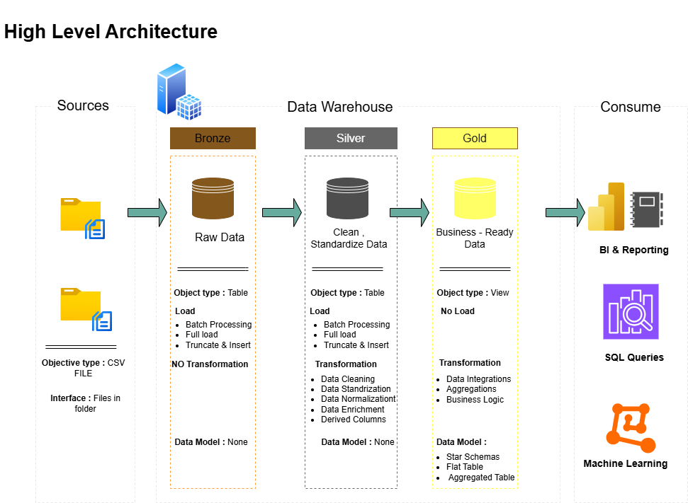

# Data Warehouse and Analytics Project

Welcome to the **Data Warehouse and Analytics Project**! 🚀  

This repository showcases a complete data warehousing workflow — from data extraction to transformation and analytics. The goal of this project is to demonstrate how raw data can be converted into meaningful insights using structured data pipelines and analytical techniques.

## 🏗️ Data Architecture

The data architecture for this project follows Medallion Architecture **Bronze**, **Silver**, and **Gold** layers:


1. **Bronze Layer**: Stores raw data as-is from the source systems. Data is ingested from CSV Files into SQL Server Database.
2. **Silver Layer**: This layer includes data cleansing, standardization, and normalization processes to prepare data for analysis.
3. **Gold Layer**: Houses business-ready data modeled into a star schema required for reporting and analytics.


## 🔹 Project Highlights
- Data Extraction from multiple sources  
- Data Cleaning & Transformation (ETL)  
- Data Warehouse Design  
- Data Modeling (Star/Snowflake Schema)  
- Analytical Queries & Insights  
- Dashboard / Reporting (if applicable)

## 🎯 Objective
To build a scalable data warehouse and perform analytics that help in better decision-making using structured and organized data.

## 🛠️ Tools & Technologies
- SQL  
- Python  
- Pandas / NumPy  
- ETL Pipeline  
- Data Warehouse Concepts  
- Power BI / Tableau (if used)

## 📌 Project Requirements

To run and understand this project, ensure you have the following:

### 🔹 Technical Requirements
- Basic knowledge of Data Warehousing concepts
- Understanding of ETL (Extract, Transform, Load)
- SQL for data querying
- Basic Python for data processing (optional)
- Knowledge of data analytics concepts

### 🔹 Software Requirements
- Python 3.x
- Jupyter Notebook / VS Code
- SQL Database (MySQL / PostgreSQL / SQL Server)
- Power BI / Tableau (for visualization)
- Git & GitHub

### 🔹 System Requirements
- Minimum 4GB RAM (8GB recommended)
- Windows / Linux / macOS
- Internet connection for dataset download

### 🔹 Dataset Requirements
- Structured dataset (CSV / Excel / Database)
- Clean or raw data for ETL process
- Multiple tables for warehouse design

  ## 📂 Repository Structure
```
data-warehouse-project/
│
├── datasets/                           # Raw datasets used for the project (ERP and CRM data)
│
├── docs/                               # Project documentation and architecture details       
│   ├── high_level_architecture         # Draw.io file shows the project's architecture
│   ├── data_catalog.md                 # Catalog of datasets, including field descriptions and metadata
│   ├── data_flow                       # Draw.io file for the data flow diagram
│   ├── Integration_Models.drawio       # Draw.io file for data models (star schema)
│   ├── naming-conventions.md           # Consistent naming guidelines for tables, columns, and files
│
├── scripts/                            # SQL scripts for ETL and transformations
│   ├── bronze/                         # Scripts for extracting and loading raw data
│   ├── silver/                         # Scripts for cleaning and transforming data
│   ├── gold/                           # Scripts for creating analytical models
│
├── tests/                              # Test scripts and quality files
│
├── README.md                           # Project overview and instructions
├── LICENSE                             # License information for the repository
├── .gitignore                          # Files and directories to be ignored by Git
└── requirements.txt                    # Dependencies and requirements for the project
```
---


  ## 👨‍💻 About Me

I am an aspiring Data Analyst with a strong interest in Data Warehousing and Analytics. I am currently learning tools like SQL, Python, Excel, and Power BI to build data-driven solutions and extract meaningful insights from raw data.  

This project is part of my learning journey where I focus on understanding ETL processes, data modeling, and building structured data warehouses for analytics and reporting. I enjoy working with data, solving problems, and continuously improving my analytical skills.

I am actively building projects to strengthen my portfolio and gain hands-on experience in Data Analytics and Data Engineering concepts.
